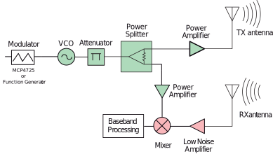

# Advise

The FMCW radar project is a very exciting project but it has many difficulties. First of
all, it is a project that requires a long time since it involves many aspects of electrical engineering and takes many steps to build a prototype. Ideally, you should start with a modular approach, test all the modules
separately and then join them in a final design. To carry out this project ideally it should be done between three people in this way the signal processing part could be included. RF is a very exciting field but depending the project doing at your home will be very difficult because as we rise the frequency the equipment gets very expensive. If you want to make a Radar or do some stuff related to radio frequency: SDR, Radio Receivers/Transmitters, Antennas, ...  take a look at the following sources:

+ [University of California EEC134](https://github.com/ucdart/UCD-EEC134)
+ [Third version of homemade 6 GHz FMCW Radar](https://hforsten.com/third-version-of-homemade-6-ghz-fmcw-radar.html)
+ [ARRL Handbook](http://www.arrl.org/arrl-handbook-2019)

This repo is for remember myself that I was able to make a radar with the aid of my bachelor thesis supervisor. Thank you Javier, this project would not have been the same without your wisdom and your hands on expertise. :)

# FMCW-RADAR Project

The primary purpose of this project was to design and implement an Frequency Modulated Continous Wave Radar (FMCW) system centered at 5.8 GHz which can perform range, Doppler,
and synthetic aperture radar (SAR) measurements. The project was done with a modular design
approach and it had the following deliverables

+ RF front end board
+ Tx/Rx Antennas both Vivaldi type

## Target Audience 

The target audience of this project encompasses educational institutions or any individual
afiliated or not to any educational institution. All of the outputs of the project has a MIT License and are avaible at github. 

## Architecture general overview

A homodyne receiver is selected due to its small size and low parts count. In the following figure we
have a basic diagram of the radar system. In green we have the transmitter path and in red
we have the receiver path.

img//experimental-setup-1.jpg
## General overview of the results

### Vivaldi Antenna

Usually radars use very directional horn antennas. Directionality of the beam is important
so that only signal from the target is picked up instead of the surroundings. Besides the
directionality radar antenna should have low sidebands so that antenna to antenna coupling
is low and it doesn’t pick up reflected signals from behind and sides of the radar. 
Maybe a pyramidal horn antenna would be a good choice it can fulfill all the specifications
but it has high cost. Another option was Patch antenna but it was discarted due to it has a
low fractional bandwidth.
Finally, we decided to made a Vivaldi antenna. Vivaldi antennas are useful for any frequency, as all antennas are scalable in size for use at any frequency. Printed circuit technology
makes this type antenna cost effective at microwave frequencies exceeding 1 GHz.

The substrate of the antenna vivaldi was chosen
as a low cost FR4 material of thickness 1.2 mm. This was an error since the simulation was
done with a thickness of 0.8mm. The third antenna was fabricated with a thickness of 0.8mm. For this antenna the experimental data fits better with the simulation.

### Bottom 

### Top

### Experimental Results compared with simulation ones.

    
As we can see in the previous figure the reflection coefficient at the input relative to 50-ohm reference
impedance is below -10 dB for the frequency range from 3.1 GHz to 11 GHz.

## Radar board results

The radar test board is the last step of the test phase.  Prior to that a modular test approach was followed to verify that every component of the radar worked as expected. In the following figure is shown the final PCB of the radar system. In this stage it was encountered that the footprint of the VCO was not correct. Due to this the test applied to the radar was difficult
and hence the results are poor.

## Experimental Results 

   

   

####  A. Spectrum of the output signal before going to the transmitter antenna

#### B. Spectrum of the output of the mixer

The output of the Mixer is shown in Figure B. As is shown the baseband spectrum is
centered approximately at 44MHz and it has -22dB of power. This signal was acquired directly
with the aid of an active probe at the output of the Mixer. The signal that was being sent
with transmitter antenna is shown in Figure A.

## Some Future Ideas

+ Change the center frequency of 5GHz to 2.4GHz. 
+ Change the Wilkinson Divider for Coupler divider design. This could give us the flexibility to redistribute the power.
+ A 4 layer layout design is better option to design the radar since this way we separate
the signal layer with power and ground layer.
+ Process the IF signal with the aid of a microcontroller. Before processing the signal 
with a microcontroller a base band signal board has to be done in order to accomodate
the signal to the input ADC of the microcontroller.

